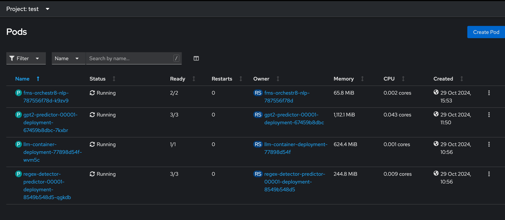

# Setup 

1. Create a new namespace in your Kubernetes cluster
```bash
oc new-project test
```

2. Deploy the generator model using KServe Serverless

    - navigate to `generator/caikit-standalone-deployment/grpc-deployment`
    - run `just create-caikit-all`

3. Deploy the detector model using KServe Serverless

    - navigate to `detectors`
    - run `oc apply -f regex_isvc.yaml`         

4. Deploy the orchestrator 
    
     - navigate to `orchestrator`
    - run `config.yaml`

5. You should eventually see the following pods within the `test` namespace: 


6. Within the orchestrator pod, execute the following commands to test the some of the information endpoints
```bash
curl -v http://localhost:8034/info
curl -v http://localhost:8034/health
```

7. Within the orchestrator pod, execute the following command to test the classification-with-text-generation endpoint
```bash
curl -v -H "Content-Type: application/json" -H "Authorization: Bearer $SA_TOKEN" --data '{
    "model_id": "gpt2",
    "inputs": "dummy input",
    "guardrail_config": {
        "input": {
            "masks": [],
            "models": {}
        },
        "output": {
            "models": {}
        }
    }
}' http://localhost:8033/api/v1/task/classification-with-text-generation
```